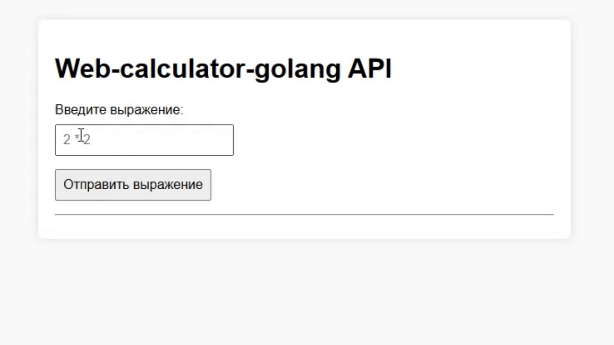
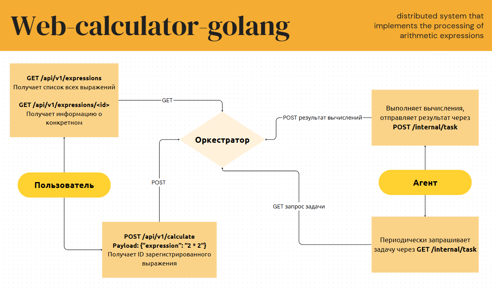
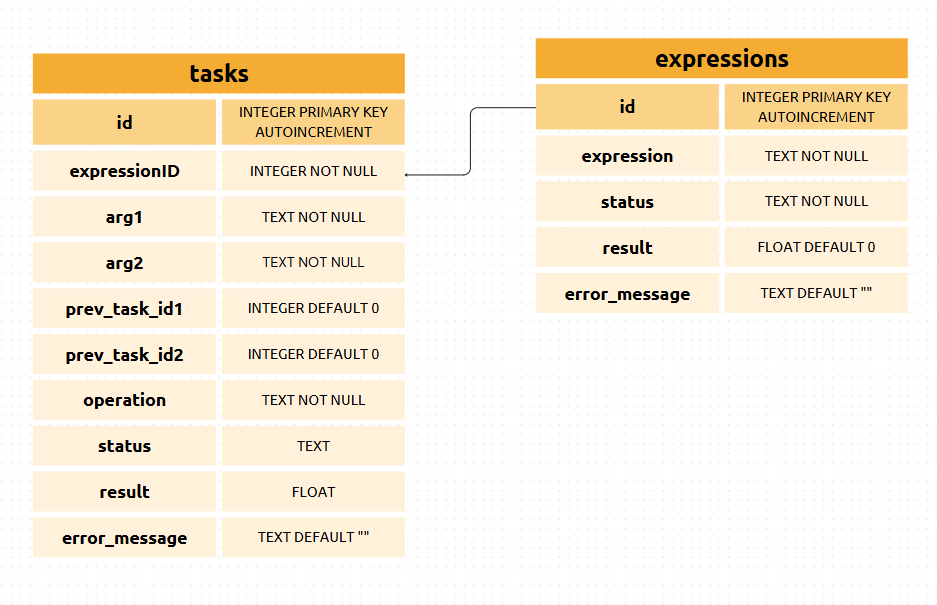

# Web-calculator

**Web-calculator** – это распределённая система, реализующая обработку арифметических выражений.

## ⚠️ Важный комментарий
Привет! Я автор проекта, надеюсь, что он вам понравится. Меня можно найти в [telegram](https://t.me/bulbosaurus), а также написать на электронную почту ```sofiytula71@gmail.com```. В коде я оставляю комментарии к экспортируемым функциям и глобальным переменным в соответствии с правилами ```go-lint```

## Функционал

- Поддерживаются операции сложения, вычитания, умножения и деления, а также выражения в скобках
- Выражение может вводиться как с пробелами между числом и операндом, так и без
- Калькулятор принимает на вход положительные целые числа
- Доступен графический интерфейс по адресу ```http://localhost:8080```



## Принцип работы проекта
В основе системы лежит взаимодействие двух основных компонентов:

- **Оркестратор**
  Центральный сервер, который:
  - Предоставляет вычислительные задачи посредством ```GET``` запроса к эндпоинту ```/internal/task```
  - Принимает результаты вычислений посредством ```POST``` запроса к тому же эндпоинту ```/internal/task```

- **Агент**  
  Компонент, который:
  - Периодически запрашивает у оркестратора задачу "дай задачку поработать"
  - Выполняет вычисления
  - Отправляет вычисленный результат обратно на оркестратор

### Архитектура проекта



## Зависимости

- Go версии ```1.23``` или новее
- Дополнительные библиотеки (указаны в ```go.mod```)


## Установка

1. Клонирование репозитория

```bash
git clone https://github.com/bulbosaur/web-calculator-golang
```

2. Запуск сервера из репозитория проекта

Необходимо находиться в корневой директории проекта (web-calculator-golang)

Для запуска каждого из двух сервисов Вам потребуется 2 отдельных терминала. 

В первом необходимо ввести команду:

```bash
go run ./cmd/orchestrator/main.go
```
Дождитесь запуска сервера, при первом старте это может занять довольно много времени:

```bash
2025/01/01 00:00:00 Starting server...
2025/01/01 00:00:00 Configuration: ORC_HOST=localhost, ORC_PORT=8080, TIME_ADDITION_MS=100, TIME_SUBTRACTION_MS=100, TIME_MULTIPLICATIONS_MS=100, TIME_DIVISIONS_MS=100, DATABASE_PATH=./db/calc.db
2025/01/01 00:00:00 Database path: ./db/calc.db
2025/01/01 00:00:00 Successful connection to the database
2025/01/01 00:00:00 Orchestrator starting on localhost:8080
```

А во втором:

```bash
go run ./cmd/agent/main.go
```


## Переменные окружения

| Переменная                             | Описание                                            | Значение по умолчанию |
|----------------------------------------|-----------------------------------------------------|-----------------------|
| ```SERVER_ORC_PORT```                  | Порт для запуска сервера                            | 8080                  |
| ```SERVER_ORC_HOST```                  | Хост для запуска сервера                            | localhost             |
| ```DURATION_TIME_ADDITION_MS```        | Время выполнения операции сложения в миллисекундах  | 100                   |
|```DURATION_TIME_SUBTRACTION_MS```      | Время выполнения операции вычитания в миллисекундах | 100                   |
| ```DURATION_TIME_MULTIPLICATIONS_MS``` | Время выполнения операции умножения в миллисекундах | 100                   |
| ```DURATION_TIME_DIVISIONS_MS```       | Время выполнения операции деления в миллисекундах   | 100                   |
| ```DATABASE_PATH```                    | Путь к базе данных                                  |./db/calc.db           |
| ```WORKER_COMPUTING_POWER```           | Количество горутин, выполняющих вычисления          | 5                     |

Задать новые переменные окружения можно:

- В **.env** файле:

```bash
# ./config/.env
server.ORC_HOST=example.com
server.ORC_PORT=8000

duration.TIME_ADDITION_MS=300
duration.TIME_SUBTRACTION_MS=300
duration.TIME_MULTIPLICATIONS_MS=300
duration.TIME_DIVISIONS_MS=300

DATABASE_PATH=C:/path/to/database.db

worker.COMPUTING_POWER=1
```

- в **PowerShell** перед запуском программы:

``` bash
$env:SERVER_ORC_HOST = "example.com"
$env:SERVER_ORC_PORT = "8000"

$env:DURATION_TIME_ADDITION_MS       = "300"
$env:DURATION_TIME_SUBTRACTION_MS    = "300"
$env:DURATION_TIME_MULTIPLICATIONS_MS = "300"
$env:DURATION_TIME_DIVISIONS_MS      = "300"

$env:DATABASE_PATH = "C:/path/to/database.db"

$env:WORKER_COMPUTING_POWER = "1"
```

- D терминале для **Linux/MacOS**:

``` bash
export SERVER_ORC_HOST=example.com
export SERVER_ORC_PORT=8000
export DURATION_TIME_ADDITION_MS=300
export DURATION_TIME_SUBTRACTION_MS=300
export DURATION_TIME_MULTIPLICATIONS_MS=300
export DURATION_TIME_DIVISIONS_MS=300
export DATABASE_PATH=/path/to/database.db
export WORKER_COMPUTING_POWER=1
```

- Для **Windows** (CMD):

``` bash
   set SERVER_ORC_HOST=example.com
   set SERVER_ORC_PORT=8000
   set DURATION_TIME_ADDITION_MS=300
   set DURATION_TIME_SUBTRACTION_MS=300
   set DURATION_TIME_MULTIPLICATIONS_MS=300
   set DURATION_TIME_DIVISIONS_MS=300
   set DATABASE_PATH=C:\path\to\database.db
   set WORKER_COMPUTING_POWER=1
```

## Внешний API

**1. Создание выражения для вычисления**

- HTTP метод: ```POST```  
- Endpoint: ```/api/v1/calculate  ```
- Отправляемые данные:  
  JSON объект с полем "expression", содержащим математическое выражение.
  
  ```json
  {
    "expression": "2 * 2"
  }
  ```
  

- Получаемые данные:  
  - В случае успешного создания задания сервер возвращает JSON объект с идентификатором выражения (код ```200 OK```):
    
    ```json
    {
      "id": 1
    }
    ```
    
  - При неверном формате запроса возвращается ошибка (код ```400 Bad Request```):
    
    ```json
    {
      "error": "Bad request",
      "error_message": "invalid request body"
    }
    ```
    
  - При использовании неподдерживаемого HTTP метода возвращается код ```405 Method Not Allowed```.

---

**2. Получение списка всех выражений**

- HTTP метод: ```GET```  
- Endpoint: ```/api/v1/expressions ``` 
- Отправляемые данные:  
  Запрос не содержит тела.

- Получаемые данные:  
  - В случае успешного выполнения запроса сервер возвращает массив JSON объектов, содержащих информацию о выражениях (код ```200 OK```):
    
    ```json
    {
      {
        "id": 1, 
        "expression": "3 - 2 / 8", 
        "status": "done", 
        "result": 2.75, 
        "ErrorMessage": ""
      }, 
      {
        "id": 2, 
        "expression": "2+2*2", 
        "status": "done", 
        "result": 6, 
        "ErrorMessage": ""
      }
    }
    ```
    

---

**3. Получение информации о конкретном выражении**

- HTTP метод: ```GET```  
- Endpoint: ```/api/v1/expressions/<id>```  
  Где ```<id>``` - идентификатор выражения, например, ```/api/v1/expressions/11```

- Отправляемые данные:  
  Запрос не содержит тела.

- Получаемые данные:  
  - В случае успешного выполнения запроса сервер возвращает JSON объект с информацией о запрошенном выражении (код ```200 OK```):
    
    ```json
    {
      "id": 11, 
      "expression": "2*2", 
      "status": "done", 
      "result": 4, 
      "ErrorMessage": ""
    }
    ```
    

---

```4. Кофе брейк```

- HTTP метод: Любой  
- Endpoint: ```/coffee ``` 
- Отправляемые данные:  
  Запрос не содержит тела.

- Получаемые данные:  
  - Сервер возвращает сообщение ```"I'm a teapot"``` с кодом ответа``` 418 I'm a teapot```.

---

**5. Любой другой несуществующий путь**

- HTTP метод: Любой  
- Endpoint: ```/api/v1/tea``` (пример)  
- Отправляемые данные:  
  Запрос не содержит тела.

- Получаемые данные:  
  - Сервер возвращает сообщение ```"404 page not found"``` с кодом ответа ```404 Not Found```.
## Внутренний API

**1. Получение задания (агент → оркестратор)**

- **HTTP метод:** GET  
- **Endpoint:** `/internal/task`  
- **Отправляемые данные:**  
  Агент не отправляет никаких данных в теле запроса.

- **Получаемые данные:**  
  - В случае успешного выполнения запроса сервер возвращает JSON объект с заданием, который выглядит примерно так:
```json
    {
    "task": {
        "ID": 2939,
        "ExpressionID": 106,
        "Arg1": 2,
        "Arg2": 8,
        "PrevTaskID1": 0,
        "PrevTaskID2": 0,
        "Operation": "/",
        "Status": "awaiting processing",
        "Result": 0
    }
}
```
  - Если заданий для обработки нет, сервер возвращает HTTP статус 404 (Not Found).
  - Если происходит внутренняя ошибка, возвращается HTTP статус 500 (Internal Server Error).

---

**2. Отправка результата вычислений (агент → оркестратор)**

- **HTTP метод:** POST  
- **Endpoint:** `/internal/task`  
- **Отправляемые данные:**  
  После вычислений агент отправляет JSON объект, содержащий:
  - `id`: идентификатор задачи, которую агент обрабатывал.
  - `result`: вычисленное значение.
  - `error_message`: строка с описанием ошибки, если она произошла, или пустая строка в случае успешного вычисления.
  
  Пример отправляемых данных:
  ```json
  {
    "id": 1,
    "result": 13,
    "error_message": ""
  }


### Примеры работы

Для отправки POST запросов удобнее всего использовать программу [Postman](https://www.postman.com/downloads/).
Удобная коллекция с примерами запросов: https://documenter.getpostman.com/view/40465298/2sAYdinpZ5

## База данных



## Тестирование

```bash
go test -v  ./...
```